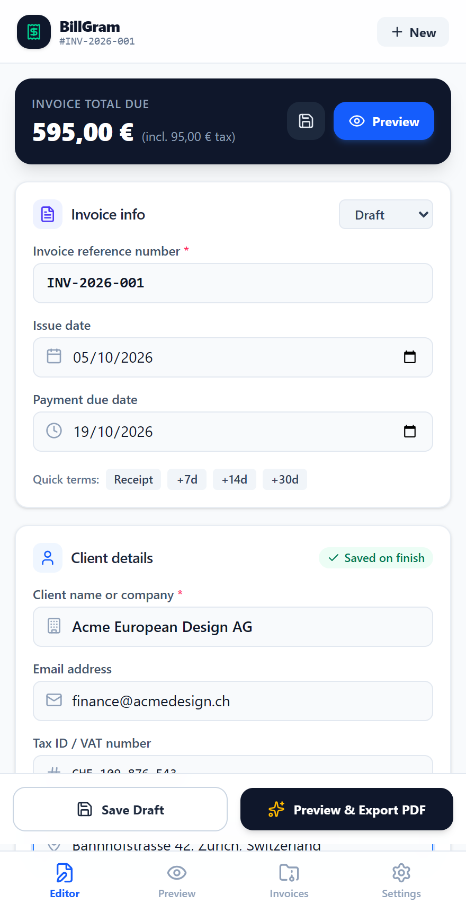
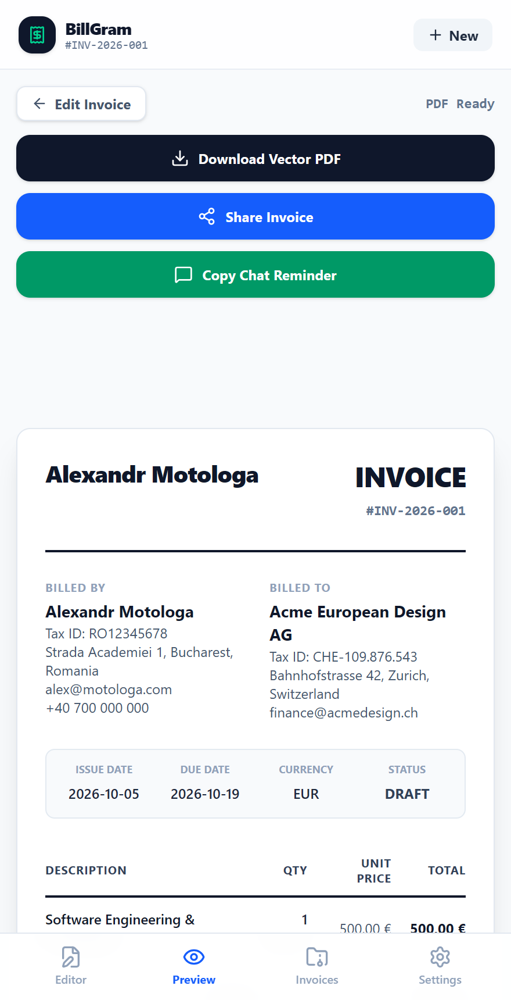
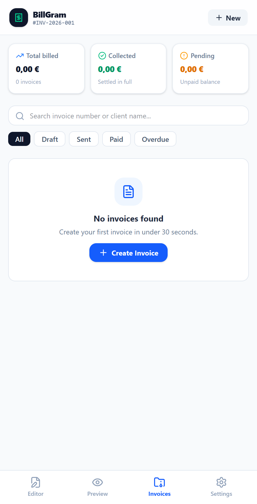
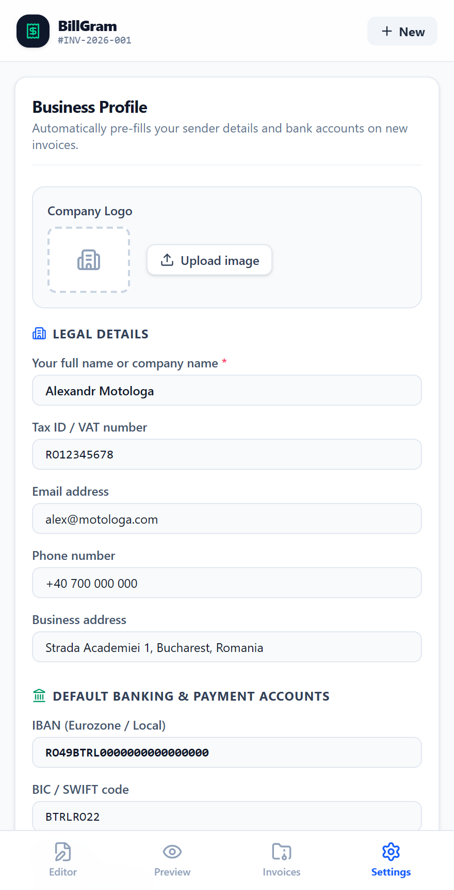

<p align="center">
  
</p>

<h1 align="center">BillGram</h1>

<p align="center">
  <a href="https://github.com/alexandrmotologa/billgram/actions"></a>
  <a href="https://react.dev"></a>
  <a href="https://www.typescriptlang.org"></a>
  <a href="https://tailwindcss.com"></a>
  <a href="LICENSE"></a>
</p>

BillGram is a client-side invoicing Telegram Mini App for freelancers and independent contractors. It compiles vector PDF invoices with embedded European SEPA/EPC banking QR codes and digital payment links directly on mobile or desktop browsers in about 30 seconds.

All calculations, QR matrix encoding, and PDF rendering execute locally in browser memory. Financial records and client details stay on your device and inside Telegram CloudStorage without hitting an external API.

<p align="center">
  
</p>

### Interface gallery

| Invoice editor and line items | Swiss PDF preview with EPC QR |
| :---: | :---: |
|  |  |

| History and revenue summary | Settings, signature pad and backups |
| :---: | :---: |
|  |  |

## Features

- **European EPC QR standard**: Encodes EPC069-12 (BCD 002 SCT) payloads so banking apps in SEPA jurisdictions scan and autofill recipient IBAN, BIC, exact amount, and invoice reference.
- **Alternative payment rails**: Generates scannable QR codes and payment URLs for Revolut RevTag, Stripe links, and TON wallet addresses.
- **Three document templates**: Switch between Swiss Minimalist (monochrome typographic grid), Executive Classic (formal bordered header), and Modern Compact (space-efficient layout).
- **Multilingual invoices**: Translate generated PDFs into English, Romanian, German, or French with localized table headers, terms, and tax summaries.
- **Touchscreen signature pad**: Draw a digital signature directly on screen or upload a transparent PNG to embed into the generated PDF.
- **Service catalog**: Save frequently billed tasks, flat fees, and hourly rates for one-tap insertion into new invoices.
- **Client directory**: Stores client addresses, VAT IDs, and contact emails with instant autofill on new invoices.
- **Retainer billing**: Duplicate any existing invoice with adjusted dates for the following month in one tap.
- **Accounting export**: Export invoice records to RFC-4180 CSV for spreadsheet accounting or download a full JSON backup to restore later.
- **Telegram integration**: Syncs with Telegram CloudStorage, provides haptic feedback, reacts to dark and light Telegram themes, and generates payment reminder text ready to paste into chat.

## Payment standards

| Payment rail | Payload format | Purpose |
| :--- | :--- | :--- |
| SEPA EPC QR | EPC069-12 (BCD 002 SCT) | Eurozone bank transfers scanned directly by mobile banking apps |
| Revolut | `https://revolut.me/{tag}` | Peer-to-peer Revolut transfers |
| Stripe | `https://buy.stripe.com/{id}` | Credit cards, Apple Pay, and Google Pay |
| TON / USDT | `ton://transfer/{address}` | Native Telegram wallet and TON blockchain transfers |

## Architecture

BillGram runs as a static single-page application inside Telegram's WebApp container or any modern web browser.

- **UI framework**: React 19 with Vite 8
- **Styling**: Tailwind CSS v4
- **State and persistence**: Zustand with a dual-storage adapter (Telegram CloudStorage bridge with localStorage fallback)
- **PDF engine**: `@react-pdf/renderer` compiling vector documents in browser memory
- **QR generator**: `qrcode` generating high-resolution vector and canvas data URLs
- **Telegram bridges**: `@telegram-apps/sdk-react` with native Telegram WebApp fallbacks

## Quick start

### Prerequisites

- Node.js 20 or later
- npm or pnpm

### Development

```bash
# Clone repository
git clone https://github.com/alexandrmotologa/billgram.git
cd billgram

# Install dependencies
npm install

# Start development server
npm run dev
```

### Production build

```bash
# Type check and bundle
npm run build

# Preview build locally
npm run preview
```

### Testing and verification

```bash
# Run unit and integration tests
npm test

# Run linter
npm run lint
```

## Telegram Mini App deployment

To connect BillGram to a Telegram Bot:

1. Open Telegram and search for `@BotFather`.
2. Create your bot with the `/newbot` command.
3. Register the web app using `/newapp`, select your bot, and enter your deployed URL (such as Vercel or Cloudflare Pages).
4. Launch the app from the bot chat menu button or inline attachment menu.

## License

MIT License. See [LICENSE](LICENSE) for details.
